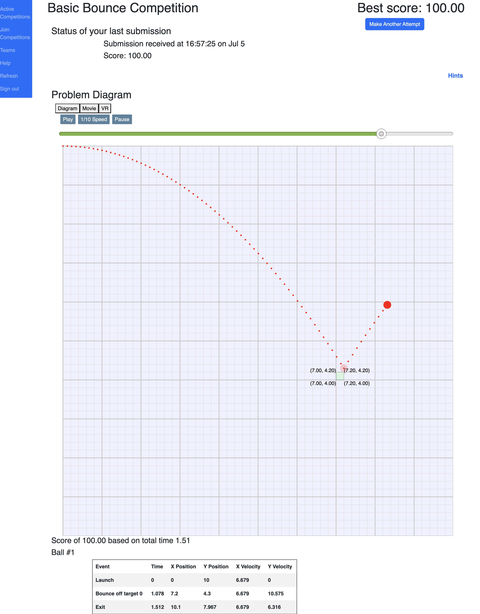

# PhysicsCompetition Contributions

This repo contains my contributions to a project I worked on through the Summer
of 2022. Throughout this project, over a total of 400 hours programming, I
learned/improved these skills:

- Programming using Javascript - this was my first experience with Javascript,
  and I got to know it quite well by the end!
  - Classes
  - Modules
  - Lambda functions
  - Working with complex `json` files
  - Promises
- Three.js
  - Types of Three.js geometry, of note:
    - `LatheGeometry`
    - `ExtrudeGeometry`
  - PRB materials
    - Three.js's `MeshLambertMaterial`
  - UV mapping/remapping
  - Asynchronous textuure material loading/application
  - Basic (kind of) virtual space design
- Developing for VR
  - WebXR/Three.js's `WebXRManager`
  - Graphics optimisation
  - [`three-mesh-ui`](https://github.com/felixmariotto/three-mesh-ui) (a library for creating VR user interfaces) and basic UI design
  - Raycasting (for VR controller pointer)
- React
  - Component mounting
  - Frame rendering
- Git/GitHub workflows
  - Merge conflicts and resolution
  - GitHub issues, assigning and resolving
- General programming techniques
  - Working with other programmers
    - Working within a large codebase written by other people
    - Learning and following existing code formatting styles
  - Bugs
    - Use of debugging tools
      - Breakpoints
      - Watching variables/objects
    - Identifying and improving legibility of code and documentation
  - Use of AI as an assistant, not for writing code for me, but for:
    - Examples of relevant Three.js code
    - Narrowing down bug possibilities
    - Code restructuring
    - Assisting in code documenting

While I can't share the whole project, I can share all of the files I wrote
myself, and I will give a description of the project structure to give an idea
of how my code fitted in.

## Project description

`PhysicsCompetition` is a tool designed to assist in learning and demonstrating
knowledge visually and satisfyingly in a high-school level class. The teacher
could assign physics problems as homework, or create teams of students as a
competition.

There were three types of physics problem, and I mostly worked on:

_Bounce_: A ball is fired from a cannon, and the students must calculate the
required exit velocity of the cannonball to bounce off of certain platforms
in the shortest time and number of cannon shots. Once a platform was hit,
it would retract so that it couldn't be hit again in that attempt. The values
that the students had to submit were:

- The velocity of the ball when leaving the barrel
- The X and Y coordinates where the ball would leave the frame (which would
  either be on the far right side, or falling out of the bottom of frame)
- The time that the ball exits the frame

When I joined the project, there were two ways to view the results of your
submission in real time: an SVG animation that showed the path the ball took
along with the coordinates of each obstacle hit, or a 3D view using Three.js
and PBR materials. I added a third view to that, enabling a 3D view to be
opened in a headset like the Oculus/Meta Quest 2 by just visiting the
web page and pressing a button.

### Project structure

The project had three main components:

- the REST server, which would handle queries to the SQL database for previous
  submissions and results,
- the Evaluation Client, a physics engine written in Java with the task of
  handling all relevant calculations of ball physics and providing a "movie" of
  frames for the ball's movement, and
- the web ui frontend, which would provide the website the students would
  access, and handle displaying the SVG or Three.js views of the competition.

## My roles in the project

I had two main roles to play in the developoment of this project:

- to redesign the currently existing Three.js environment being used for the
  Bounce competition 3D view to be more visually pleasing, while refactoring
  and cleaning up relevant code, and
- to add a third view, VR, based on the existing 3D view, and deal with any
  design or code changes related to this.

### Environment redesign

My first job, after reading through relevant parts of the codebase to become
accustomed to how the product functioned, was to redesign the 3D room that the
Bounce 3D View displayed in. At the time, it was a square room with simple
concrete PBR textures on the walls, and a floating vertical 10m $`\times`$ 10m
steel slab in the centre of the room as the backdrop of the simulation. The
ball and obstacles all used the same steel texture, and the lighting was from a
single point source at the top of the room.

My brief for the redesign was to go with a more steampunk feel, with some
material suggestions and design ideas being:

- Brick
- Dark wood
- Brass
- Warehouse-feel

Up until this point, all of this scene creation code had been inside of
`UI/src/components/Submits/Bounce/Bounce3DView.jsx`, and was taking up the
majority of the file, so I moved it out to `BounceSceneGroup.js`, and organised
the whole file into smaller functions to reduce repetition, and I tried to keep
each function under 100 lines.

### VR support

## File and directory descriptions

Here is a description of the purpose of each file and directory in this repo
(ignoring irrelevant files in `Sandbox/`):

### `Docs/Oculus/`

Documentation files for all of my work and research into implementing VR
support for PhysicsCompetiton, specifically geared towards use with an
Oculus Quest 2 (now called Meta Quest 2) or similar headset, but also
investigating support for other headsets.

#### `Docs/Oculus/Bibliography.md`

An annotated bibliography of different VR frameworks I could use to implement
VR support for the project. I investigated different methods I could use to
implement VR support, and collected resources and links to different tools and
frameworks of the options I came across.

#### `Docs/Oculus/DevelopmentTools.md`

A file containing instructions for setting up an Oculus/Meta Quest 2 headset
for developmental use, including sections for:

- Enabling Developer Mode
- Enabling, downloading and setting up Android Debug Bridge, to allow your
  computer's localhost ports to be forwarded to the headset
- Downloading SideQuest, allowing for sideloading APKs directly to the
  headset over wifi or USB-C cable
- Downloading and setting up OVR Metrics Tool, which displays metrics such as
  frame rate, GPU and CPU usage as an overlay for debug purposes

### `Sandbox/`

A directory to hold experiments related to the project, such as testing
Three.js tools.

#### `Sandbox/ColorWriteCSG/`

A test program, designed to be run using the VSCode extension Live Server,
which allows html files to be test run in the browser quickly and easily.

The purpose of the program was to test whether setting `colorWrite` to false
would enable for one mesh to visually punch a hole through another mesh, and
whether this could be used to build Constructive Solid Geometry.

#### `Sandbox/VRRotatingCubes/`

A test program, designed to be run using the VSCode extension Live Server,
which allows html files to be test run in the browser quickly and easily.

This program tests Three.js's WebXR integration to add VR/XR functionality to
Three.js scenes. This integration allows for a VR user to navigate to a
webpage in their headset, click a button labeled "Enter VR", and a VR session
is initiated.

The scene has several rotating cubes, which can be selected and moved by the
user by using the index finger trigger on the controllers.

The program can be tested without the need for a VR headset by using the
WebXR APII Emulator extension on Chrome or any other Chromium based browser.

##### `Sandbox/VRRotatingCubes/ControllerPickHelper.js`

An early test version of
[`UI/src/components/Util/ControllerPickHelper.js`](#uisrccomponentsutilcontrollerpickhelperjs)},
which handles object selection using the VR headset's handheld controllers.

On construction, `ControllerPickHelper` would get all active controllers, add
event listeners for selection events, and add pointer lines to each controller.

The `update` method would use raycasting to get the closest object that
intersects with a ray cast from the front of the controller, and would make
the selection line flash when an object was selected.

### `UI/src/components/Util`

A directory to hold relevant util functions and classes for use in multiple
competition types and throughout multiple files.

#### `UI/src/components/Util/AsyncMaterials.js`

This file handles the creation of all of the materials used in the Three.js
scenes throughout the project (mostly in Bounce, although some are in Land Grab
as well). Loading all of these materials takes time, so each material returns
an object with two properties: a promise for when the material's textures have
loaded, and a simple HEX colour to use as a placeholder until the promise
resolves.

#### `UI/src/components/Util/SceneUtil.js`

This file contains miscellaneous util functions related to image, material,
texture and element handling. These functions include many functions for
creating different types of element, removing boilerplate code and making
scene creation code easier to read and write.

There are also two other important functions:

##### `generateArcPoints`

This function is used to for easy lathe element creation. Lathe elements
are constructed with an array of 2D xy coordinates, which are rotated around
the y axis to create a 3D shape. The `generateArcPoints` function generates
points for curved arcs, allowing for complex shapes to be created and added to
the scene while keeping the code easy to read and write. This function is
especially useful in the creation of lathe elements, as they take an array of
points in their construction, and `generateArcPoints` can be used to create
smoothly curved shapes.

##### `fixLatheUVs`

When a lathe element is created, if there are uneven gaps between the points
array passed in during construction, the texture will be stretched unevenly.
This function iterates through the points array, calculates the distance
between neighbouring points, and stretches the uv values accordingly to even
the texture back out again.

#### `UI/src/components/Util/ControllerPickHelper.js`

This class is the evolution of
[`Sandbox/VRRotatingCubes/ControllerPickHelper.js`](#sandboxvrrotatingcubescontrollerpickhelperjs),
but is capable of more than it's test predecessor.

On construction, it handles the creation of the controllers, determines which
hand each controller belongs to, and sets each up accordingly. It also creates
a raycaster to be used in object selection later.

On `update`, the raycaster is updated to the right controller's current
position, and pointed in the direction the controller is. To handle the fact
that not every object in the scene should be selectable, every selectable
object is added to the `pickablesParent`, and the raycaster checks for
intersection with all children of this parent. The closest intersected child
is then set as selected.

### `UI/src/components/Submits/`

This directory houses all of the files related to the different competition
types and their relevant submission web page files.

Some other examples of files in this directory that aren't included in this
repository because I didn't write them are:

- `MovieController.jsx` — a React Component for displaying controls for
  navigating the movies returned after submitting values for the competiton.
  This controller would allow the user to play and pause the movie, scrub
  through, and step through frame by frame.
- `SbmPage.jsx` — a React Component that sets up a page for managing
  submissions for a competition and team, including a submission dialog,
  automatic polling for a test result on any standing submission, and a
  display of the results.

#### `UI/src/components/Submits/VRMovieController.js`

This file is essentially a version of the `MovieController` mentioned in
the description of [`UI/src/components/Submits/`](#uisrccomponentssubmits), but
specifically designed for use in VR. It keeps track of the current time offset,
and when the offset changes, it calls the `setOffset` function it is passed on
construction. The `play`, `pause` and `animate` functions are called externally
in `BounceVRView` by buttons on the UI element attached to the left VR
controller.

### `UI/src/components/Submits/Bounce/`

This directory houses all of the files for the Bounce competition.

Some files that aren't included in this repository because I didn't write them
are:

- `Bounce.jsx` — a React Component for the Bounce competition page of the
  website, including displaying the submission summary table and housing
  the competition views.
- `BounceSVGView.jsx` — a React Component for the SVG view. This view shows the
  ball and obstacles on a grid, with the coordinates of each corner of each
  obstacle (screenshot below).

Screenshot of SVG view

#### `UI/src/components/Submits/Bounce/Bounce3DView.jsx`

This file is a React Component that handles displaying the 3D view of the
Bounce competition.
